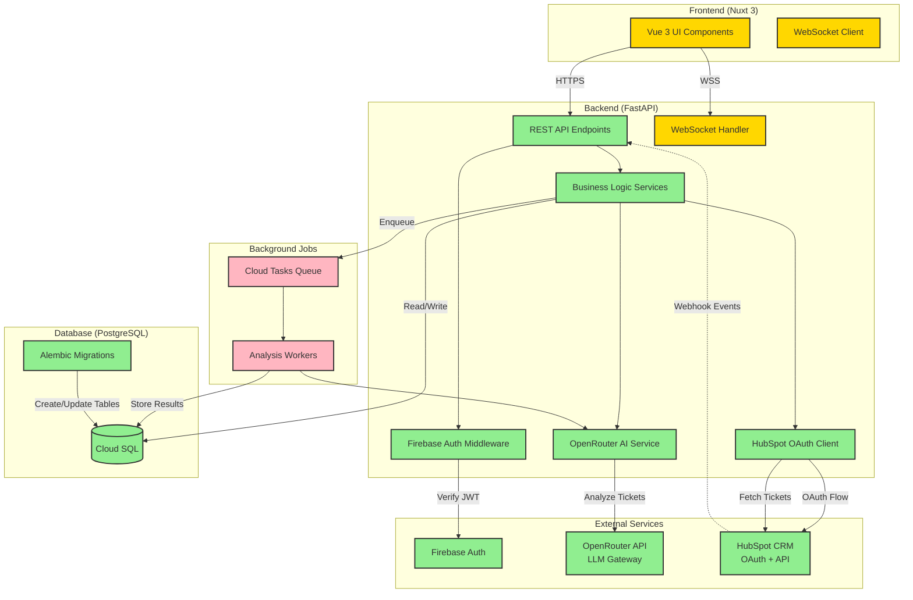

# Architecture Overview - Churn Risk App

**Last Updated:** 2025-11-09

A simple, high-level view of the Churn Risk App architecture and how components connect.

---

## System Diagram



**Legend:**
- 🟢 **Green** = Fully implemented and tested
- 🟡 **Yellow** = Partially implemented
- 🔴 **Pink** = Not yet implemented

---

## Deployment Environments

### Local Development

**Purpose:** Fast iteration, easy debugging, minimal cost

**Infrastructure:**
```
Backend:     poetry run uvicorn src.main:app --reload
Database:    docker-compose (PostgreSQL 15)
Redis:       docker-compose (Redis 7)
Frontend:    npm run dev
```

**Key Characteristics:**
- Backend runs directly via Poetry (no containerization)
- Database and Redis in Docker containers (defined in `docker-compose.yml`)
- All services on localhost
- Uses `.env` file for configuration
- Firebase credentials from local file
- HubSpot OAuth redirect to `localhost:8000`

**Advantages:**
- Fast startup (no container build time)
- Easy debugging (direct Python process)
- Simple to reset database (docker-compose down -v)
- No cloud costs

---

### Production (GCP)

**Purpose:** Scalable, managed, production-grade deployment

**Infrastructure:**
```
Backend:     Cloud Run (containerized FastAPI)
Database:    Cloud SQL for PostgreSQL (managed service)
Redis:       Memorystore for Redis (managed service)
Frontend:    Cloud Run or Cloud Storage + Cloud CDN
```

**Key Characteristics:**
- Backend containerized via Dockerfile, deployed to Cloud Run
- Managed PostgreSQL (Cloud SQL) with automated backups, high availability
- Managed Redis (Memorystore) with automatic failover
- All services communicate via private VPC
- Secrets managed via Secret Manager
- Auto-scaling based on traffic
- Custom domain with SSL

**Advantages:**
- Auto-scaling (0 to thousands of requests)
- Managed infrastructure (Google handles OS updates, security patches)
- High availability (multi-zone redundancy)
- Pay-per-use pricing
- Automated backups and point-in-time recovery
- Built-in monitoring and logging

---

### Key Differences

| Aspect | Local Development | Production (GCP) |
|--------|-------------------|------------------|
| **Backend** | Python process via Poetry | Docker container on Cloud Run |
| **Database** | Docker PostgreSQL | Cloud SQL (managed PostgreSQL) |
| **Redis** | Docker Redis | Memorystore (managed Redis) |
| **Secrets** | `.env` file | Secret Manager |
| **Scaling** | Single instance | Auto-scaling (0-1000+ instances) |
| **Cost** | Free (local resources) | Pay-per-use (with $300 free credits) |
| **Setup Time** | 5 minutes | 30-60 minutes (first time) |
| **Backups** | Manual (docker volume) | Automated daily + point-in-time |

---

## Component Descriptions

### Frontend (Nuxt 3 + Vue 3)
**Status:** 🟡 Auth complete, features in progress

**Purpose:** User interface for viewing churn risks, managing topics, and configuring integrations.

**What Exists:**
- Project scaffolding with Nuxt 3, Tailwind CSS
- Firebase Client SDK integration
- Complete authentication UI (registration, login, logout)
- Protected routes with auth middleware
- Landing page and dashboard
- User state management with Pinia
- CORS-enabled API calls to backend

**What's Missing:**
- Dashboard with charts and analytics
- Churn risk kanban board
- Topic management interface
- HubSpot onboarding flow UI

---

### Backend API (FastAPI)
**Status:** 🟢 Core endpoints implemented

**Purpose:** REST API handling authentication, business logic, and orchestrating services.

**Endpoints Implemented:**
- `GET /health` - Health check
- `GET /api/v1/` - API root information
- `GET /api/v1/integrations/hubspot/authorize` - Get OAuth URL
- `POST /api/v1/integrations/hubspot/callback` - OAuth callback
- `GET /api/v1/integrations` - List integrations
- `DELETE /api/v1/integrations/{id}` - Delete integration
- `GET /api/v1/users/me` - Current user info

**What's Missing:**
- Ticket import endpoints
- Churn risk card endpoints
- Topic management endpoints
- Webhook handlers

---

### Authentication (Firebase)
**Status:** 🟢 Fully implemented and tested

**Purpose:** User authentication and JWT token verification.

**What Works:**
- Firebase Admin SDK initialized
- Firebase Client SDK integrated in frontend
- JWT token verification middleware
- User lookup by Firebase UID
- Role-based access control (ADMIN, MEMBER, VIEWER)
- Self-service user registration with tenant creation
- Login/logout functionality
- Protected routes with auth middleware
- User state management
- End-to-end auth flow verified and working

---

### Database (PostgreSQL + SQLAlchemy)
**Status:** 🟢 Fully implemented and migrated

**Tables Created (11 total):**
- `tenants` - Multi-tenant root entity
- `users` - User accounts linked to Firebase
- `integrations` - OAuth credentials storage
- `companies` - Customer companies (from HubSpot)
- `contacts` - People at customer companies
- `tickets` - Support tickets with sentiment
- `ticket_topics` - Configurable topics for classification
- `ticket_topic_assignments` - Many-to-many ticket ↔ topic
- `churn_risk_cards` - Generated churn risk alerts
- `churn_risk_comments` - Activity timeline on cards
- `alembic_version` - Migration tracking

**Migration:** `c08085465bad` (initial schema)

---

### AI Service (OpenRouter)
**Status:** 🟢 Fully working

**Purpose:** Sentiment analysis and topic classification using LLMs.

**Features:**
- Single LLM call for sentiment + topics (cost optimization)
- 5-level sentiment scoring (very_negative to very_positive)
- Confidence scores for all predictions
- Topic extraction with reasoning
- Retry logic with exponential backoff
- Error handling and validation

**Tested:** ✅ Analyzed sample tickets with 85% confidence

---

### HubSpot Integration
**Status:** 🟢 Fully working, connected to FlxPoint HubSpot

**Purpose:** Fetch support tickets and company data from HubSpot CRM.

**Authentication:** OAuth 2.0 only (Developer API keys deprecated)

**What Works:**
- HubSpot OAuth app created via CLI (`hs-churn-risk/`)
- OAuth client ID and secret configured
- OAuth authorization URL generation
- Token exchange and refresh methods
- API client for tickets, companies, contacts (OAuth tokens only)
- OAuth flow COMPLETED (FlxPoint account connected)
- Successfully fetching real tickets from HubSpot
- Access tokens stored in Integration table
- Public OAuth callback endpoint (GET method, no auth required)

**What's Missing:**
- Webhook ingestion pipeline
- Incremental sync logic
- Bulk ticket import service

---

### Background Jobs (Cloud Tasks)
**Status:** 🔴 Not implemented

**Purpose:** Asynchronous ticket analysis and bulk imports.

**Planned:**
- `ticket-analysis` queue - Process tickets through AI
- `bulk-import` queue - Initial 200 ticket import
- `notifications` queue - Email/Slack alerts

**Current Workaround:** Direct synchronous calls for now

---

## Data Flow Examples

### Onboarding Flow (Future)
```
User → Frontend → Backend → HubSpot OAuth
                           ← OAuth tokens stored
                           → Enqueue bulk import
Cloud Tasks Worker → Fetch 200 tickets from HubSpot
                  → Analyze each with OpenRouter
                  → Store tickets + sentiment in DB
                  → Create churn risk cards for negative tickets
                  → WebSocket push to frontend
Frontend ← Real-time progress updates
```

### Real-Time Ticket Ingestion (Future)
```
HubSpot → Webhook POST to /webhooks/hubspot
Backend → Validate signature
       → Enqueue analysis task
       → Return 200 OK
Cloud Tasks Worker → Fetch full ticket details
                  → Analyze sentiment + topics
                  → Create churn risk card if negative
                  → WebSocket push to frontend
```

### Current Working Flow
```
User → Frontend test page
     → Click "Get OAuth URL"
Backend → Generate HubSpot authorization URL
       → Return to frontend
User → Click link, authorize in HubSpot
HubSpot → Redirect to callback with code
Backend → Exchange code for tokens
       → Store in Integration model (requires auth)
```

---

## Technology Stack

| Component | Technology | Status |
|-----------|-----------|--------|
| **Frontend** | Vue 3, Nuxt 3, Tailwind CSS | 🟡 Auth complete, features pending |
| **Backend** | FastAPI (Python 3.11) | 🟢 Core done |
| **Database** | PostgreSQL 15, SQLAlchemy | 🟢 Complete |
| **Auth** | Firebase Admin SDK + Client SDK | 🟢 Fully implemented |
| **AI/ML** | OpenRouter (LLM gateway) | 🟢 Working |
| **Integrations** | HubSpot OAuth 2.0 | 🟢 Connected to FlxPoint |
| **Background Jobs** | Cloud Tasks (GCP) | 🔴 Not implemented |
| **WebSockets** | FastAPI WebSocket | 🔴 Not implemented |
| **Migrations** | Alembic | 🟢 Complete |
| **Testing** | pytest, AsyncMock | 🟢 33/33 passing |
| **Hosting** | GCP Cloud Run, Cloud SQL | 🔴 Not deployed |

---

## Security Architecture

### Authentication Flow
1. User logs in via Firebase Auth (frontend)
2. Firebase returns JWT token
3. Frontend includes JWT in `Authorization: Bearer <token>` header
4. Backend middleware validates JWT with Firebase Admin SDK
5. Backend looks up User record by `firebase_uid`
6. Request proceeds with authenticated user context

### Multi-Tenancy
- Every table has `tenant_id` column
- All queries automatically filtered by tenant
- API returns 404 (not 403) for cross-tenant access attempts
- PostgreSQL Row-Level Security as safety net (future)

### Secrets Management
- Local development: `.env` file (not committed)
- Production: GCP Secret Manager (planned)
- OAuth tokens stored in encrypted JSONB column (encryption pending)

---

## Current Limitations

1. **No Background Processing**
   - All operations are synchronous
   - Won't scale for bulk imports
   - Cloud Tasks queue not set up

2. **Limited UI Features**
   - Basic dashboard exists but lacks charts/analytics
   - Churn risk kanban board not built
   - Topic management interface not built
   - HubSpot onboarding flow not built

3. **Not Deployed**
   - Running locally only
   - GCP infrastructure not provisioned (Cloud Run, Cloud SQL)

---

## What's Next (Tasks 6-16)

See detailed plan in: `docs/plans/2025-11-06-phase-1-mvp-implementation.md`

**Immediate Next Steps:**
- **Task 6:** Ticket Import & Analysis Service (bulk processing)
- **Task 7:** Churn Risk Card Creation Logic (auto-create from sentiment)
- **Task 8:** WebSocket Real-Time Updates (onboarding progress)

**Then:**
- Tasks 9-13: Frontend UI (auth, dashboard, kanban, topics)
- Task 14: Webhook handling (real-time ingestion)
- Tasks 15-16: GCP deployment & end-to-end testing

---

## Testing

- **Unit Tests:** 23/23 passing (auth, models, AI, HubSpot)
- **Smoke Tests:** `backend/scripts/smoke_test.py`
- **Manual Testing:** Frontend test page at http://localhost:3000
- **Full Guide:** `docs/dev/testing-guide.md`

---

**Document Owner:** David Hague
**Last Review:** 2025-11-08
